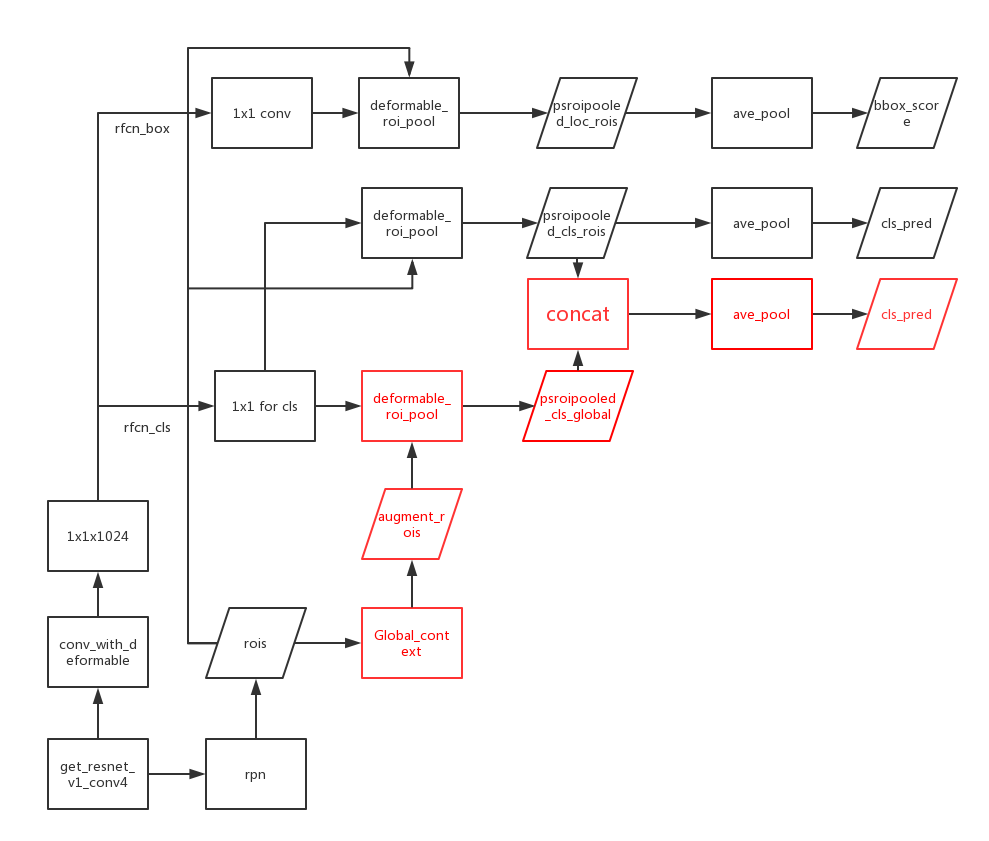

# add global context in rfcn

## 流程图

### 具体实现
流程图中红色部分为需要添加的内容。
具体包括

1. 使用op扩大`roi` 至 `global_context` 区域大小

	使用 [global_context](https://github.com/ElaineBao/mxnet/blob/master/example/rcnn/rcnn/symbol/roi_global_context.py) 代码实现。
2. 共用原有的 `rfcn-cls` 特征图和 `offsets` 完成`roi_pooling`
	[code](https://github.com/ataraxialab/Deformable-ConvNets/blob/dev-global-context/rfcn/symbols/resnet_v1_101_rfcn_dcn.py#L817-L821) 
4. 新的结果 `elements_add` 之前的结果，最终得到分类的结果
	[code](https://github.com/ataraxialab/Deformable-ConvNets/blob/dev-global-context/rfcn/symbols/resnet_v1_101_rfcn_dcn.py#L822-L823)

 

