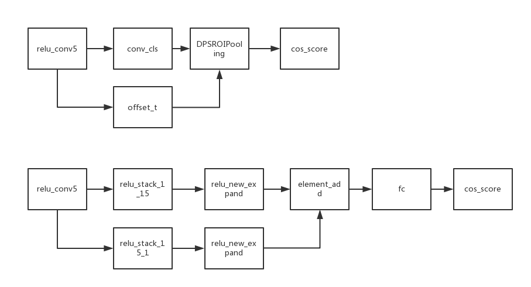

# add light head in dcn rfcn

## 参考文献
[Light-Head R-CNN: In Defense of Two-Stage Object Detector](https://export.arxiv.org/pdf/1711.07264)

## 流程图

### 具体实现
流程图中下半部分为light-head内容。
具体包括

1. 大卷积核的单方向的卷积先压缩，再展开

      [code](https://github.com/ataraxialab/Deformable-ConvNets/blob/dev-light-head/rfcn/symbols/resnet_v1_101_rfcn_dcn.py#L794-L799) 
	 
2. 将两个纬度的卷积做一个合并
	
	[code](https://github.com/ataraxialab/Deformable-ConvNets/blob/dev-light-head/rfcn/symbols/resnet_v1_101_rfcn_dcn.py#L806-L808) 
	
4. 利用FC层达到输出维度的要求
	
	[code](https://github.com/ataraxialab/Deformable-ConvNets/blob/dev-light-head/rfcn/symbols/resnet_v1_101_rfcn_dcn.py#L809-L812)

 

